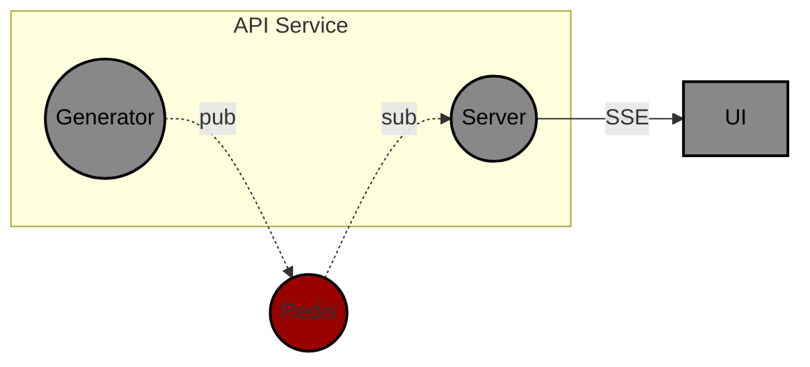
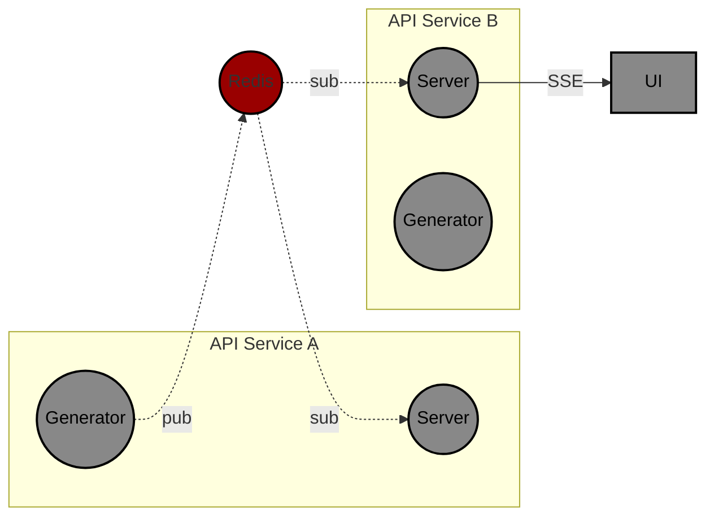

# Sample Server-Sent Events Demo

Provides a use-case example of using Server-Sent Events (SSE) as part of an
application's communication architecture.

## Comparing SSE and WebSockets

Server-Sent Events are built on the same protocols as other REST APIs and
widely supported by existing infrastructures. Another similar technology (and more
popular) are WebSockets providing very similar focus, but a more robust set of
capabilities.

Comparing these two technologies, we compare the facts between the two technologies
and explain why SSE are used:

|                | HTTP SSE                                                                                                                    | WebSockets                                                                                          |
|----------------|-----------------------------------------------------------------------------------------------------------------------------|-----------------------------------------------------------------------------------------------------|
| Protocol       | HTTP                                                                                                                        | WebSockets                                                                                          |
| Data Flow      | Server to Client                                                                                                            | Bi-Directional                                                                                      |
| Implementation | Like REST                                                                                                                   | Special Case                                                                                        |
| Pros           | - Easy to Setup <br/>- Extends existing protocols<br/>- Supported by any infrastructure that support long-lived connections | - Bi-Directional messaging <br/>- Supports Structured data packets                                  |
| Cons           | - Uni-directional <br/>- Text-only streaming                                                                                | - Requires additional modules<br/>- Needs developer to support incoming data responses from Clients |

### Use Cases

SSE
: Push Notifications, Status Updates, pair with existing REST APIs

WebSockets
: Real-Time Chat / Gaming applications, IoT devices

## Demo Application Structure

The Demo Application has 4 components that handle the event messaging:

Redis
: The message broker broadcasting messages between the "message creator" and
the "message consumer". Other PubSub technologies can also be used, like AMQP or MQTT.
Redis is chosen for it's popularity and simplicity.

Generator
: Sample application creating messages which will be consumed by the Server.

Server
: Sample API Server consuming messaged by the Generator and passing them onto any
client subscribing to these messages.

UI
: Sample Web Application that connects to the SSE Endpoint and displays the messages
on a Web Frontend.

NOTE: Should be noted the *Generator* and *Server* applications may be the same
application, but a PubSub Broker would still be used to support cross-threading or
cross-process communications, allowing for horizontal scaling.

### Data Flow

The data flow around this architecture is a linear pattern as all communication channels
follow an Event-Driven pattern, one message triggering another message.



The big difference when applying this in production is the need to scale. Since all
downstream clients will need to an API instance, all instances of the API Service must
receive the same message for downstream applications.

This demo accommodates horizontal scaling with a replicated API Server
(which is demonstrated with the "server" property in the SSE Event), but most designs
may consider the "generator" and "api" instance may be a single application.

Reflecting the diagram to support this scenario would look like:



## Usage

Working with the project first requires **Docker** and **Docker Compose** to be installed.
Then the project can be started by running:

```bash
docker compose build && docker compose up
```

The dialog will be populated as each service starts. To test the web service is working
and proxied through the web service, it's possible to run:

```bash
curl -n http://localhost/sse
```

This will connect a streaming curl session to the SSE endpoint providing content.

Next, the UI is accessible on the localhosts' default HTTP port (port 80). Open a browser
and load `http://localhost`. This should open the Index page from the UI service and will
start showing the events coming in from the SSE Endpoint.

